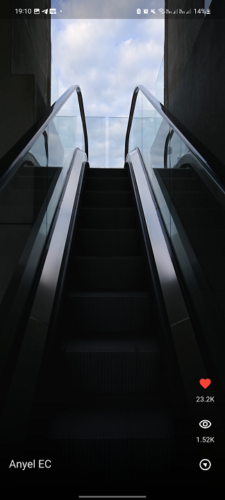

## TikTok Replica in Flutter

### Description
This project is a basic replica of the TikTok application developed in Flutter. It includes screens for discovering videos, full-screen video playback, and interactive buttons for reactions and viewing metrics.

## **Select Language:**
- [Español (Spanish)](README-es.md)
- [English](README.md)

## Result
### Video 1
 
### Video 2
 

### Project Structure
The project is structured into various files and folders:

- **`main.dart`**: Entry point of the application where the main widget `MyApp` is defined.
- **`discover_screen.dart`**: Main screen for discovering videos.
- **`discover_provider.dart`**: Data provider for the discovery screen.
- **`full_screen_player.dart`**: Widget for playing videos in full screen.
- **`video_background.dart`**: Widget to provide a gradient background for videos.
- **`video_buttons.dart`**: Widget to display interactive buttons on videos.
- **`video_scrollable_view.dart`**: Widget to display a scrollable view of videos.
- **`local_video_model.dart`**: Data model to represent local videos.
- **`local_video_posts.dart`**: Static data of local videos for testing purposes.

### Main Dependencies
- **`provider`**: For state management and dependency injection.
- **`intl`**: For formatting numbers and dates.
- **`animate_do`**: For adding animations to UI elements.
- **`video_player`**: For video playback.

### Installation and Execution
1. Clone the repository from [GitHub](https://github.com/Anyel-ec/TiktokReplication-Flutter).
2. Ensure you have Flutter installed on your system.
3. Run `flutter pub get` to install all dependencies.
4. Run the application on your device or emulator using `flutter run`.

### Versioning
The current version of the application is 1.0.0+1.
